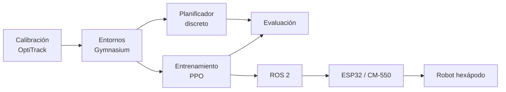

# S.P.I.D.E.R. 🕷️

**Control sim-to-real de un robot hexápodo mediante aprendizaje por refuerzo.**

[](https://github.com/Ciror3/tpFInalRLSpider/actions/workflows/ci.yml)
[](LICENSE)
[](pyproject.toml)

S.P.I.D.E.R. estudia navegación local hacia un objetivo mediante 12 comandos discretos de un hexápodo real. La política se entrena con Proximal Policy Optimization (PPO) en entornos Gymnasium construidos a partir de movimientos medidos con OptiTrack y se transfiere al robot mediante ROS 2 y un ESP32.

El repositorio contiene el código, los modelos de referencia y el protocolo para ejecutar nuevos experimentos. Las métricas, gráficos, checkpoints periódicos y demás resultados generados no se versionan: cada ejecución los guarda en `artifacts/`.

## Componentes

- Un entorno 2D compacto en coordenadas relativas.
- Un espacio de 12 acciones asociado directamente a comandos del robot.
- Una dinámica extendida `M(a[t-1], a[t])` que considera el movimiento anterior.
- Entrenamiento PPO mediante Stable-Baselines3.
- Un baseline de búsqueda discreta sobre el mismo modelo dinámico.
- Herramientas de evaluación, visualización y calibración.
- Nodos ROS 2 de referencia para OptiTrack y el controlador físico.



## Instalación

Requisitos: Python 3.10 u 3.11 y Git. La simulación headless no requiere ROS 2.

```bash
git clone https://github.com/Ciror3/tpFInalRLSpider.git
cd tpFInalRLSpider
python3.10 -m venv .venv
source .venv/bin/activate
python -m pip install --upgrade pip
python -m pip install -e '.[render]'
python scripts/smoke_test.py
```

La salida esperada muestra `OK` para el entorno estándar.

## Uso

### Baseline de planificación

```bash
spider-baseline \
  --env standard \
  --episodes 10 \
  --max-steps 200 \
  --seed 0 \
  --horizon 4 \
  --beam-width 32
```

### Entrenamiento PPO estándar

```bash
spider-train \
  --env standard \
  --total-timesteps 10000 \
  --n-envs 1 \
  --seed 0 \
  --run-name smoke-seed-0 \
  --output-dir artifacts
```

### Entrenamiento condicionado por la acción anterior

```bash
spider-train-previous \
  --total-timesteps 500000 \
  --n-envs 4 \
  --seed 0 \
  --run-name previous-action-seed-0
```

### Evaluación

```bash
spider-compare \
  --env-mode previous_steps \
  --ppo-model models/previous_action/ppo_previous_action.zip \
  --episodes 100 \
  --max-steps 200 \
  --seed 0 \
  --dwa-horizon 4 \
  --dwa-beam-width 32 \
  --output-dir artifacts/evaluation
```

Este comando genera un CSV y gráficos localmente. No hay resultados precalculados en el repositorio.

## Entornos

| Variante | Observación | Propósito |
|---|---:|---|
| `standard` | `(x, y)` | Navegación base hacia un objetivo |
| acción anterior | `(x, y)` + one-hot de 12 acciones | Dinámica condicionada |

Ambos usan metros y la API de Gymnasium. `reset(seed=N)` controla el target y el ruido de movimiento.

## Modelos de referencia

| Ruta | Entradas | Uso |
|---|---:|---|
| `models/standard/ppo_standard.zip` | 2 | Política estándar |
| `models/previous_action/ppo_previous_action.zip` | 14 | Política con acción anterior |
| `models/ablations/ppo_no_previous_action.zip` | 14 | Ablación con historial anulado |

Los `.zip` son artefactos de Stable-Baselines3 y deben cargarse con `PPO.load`. No cargues modelos obtenidos de fuentes no confiables.

## Estructura

```text
.
├── src/spider_rl/
│   ├── environments/       # MDPs y registro de variantes
│   ├── controllers/        # Baseline de búsqueda discreta
│   ├── training/           # Entrenamientos y callbacks PPO
│   ├── evaluation/         # Comparación y visualizaciones
│   ├── ros/                # Nodos ROS 2 de referencia
│   └── calibration.py      # Parser de mediciones OptiTrack
├── models/                 # Tres modelos de referencia
├── tests/                  # Contratos de entorno y controladores
├── scripts/                # Utilidades mínimas de desarrollo
├── docs/                   # Arquitectura, reproducción y hardware
├── paper/                  # Manuscrito asociado
└── artifacts/              # Salidas locales; ignoradas por Git
```

La organización sigue responsabilidades técnicas y evita que scripts, modelos y salidas experimentales se mezclen en la raíz.

## Documentación

- [Arquitectura y decisiones del MDP](docs/ARCHITECTURE.md)
- [Protocolo de reproducibilidad](docs/REPRODUCIBILITY.md)
- [Calibración y despliegue físico](docs/HARDWARE.md)
- [Hoja de ruta](docs/ROADMAP.md)
- [Cómo contribuir](CONTRIBUTING.md)

El manuscrito fuente está en [`paper/informe.tex`](paper/informe.tex).

## Alcance

El simulador modela transformaciones rígidas calibradas, no contactos y articulaciones completos. La reproducción de software no requiere hardware; la recalibración y el despliegue físico sí necesitan el robot, OptiTrack, ROS 2 y el bridge ESP32. Esas fronteras están documentadas explícitamente para no confundir simulación con validación física.

La metadata de cita está en [`CITATION.cff`](CITATION.cff). Código bajo [licencia MIT](LICENSE).
